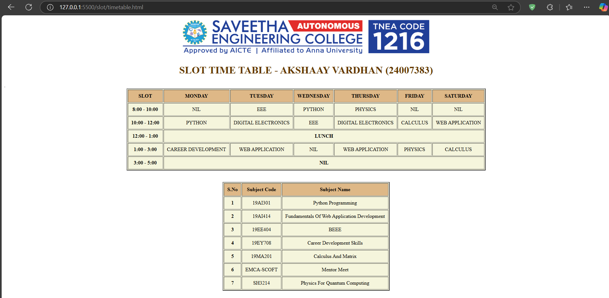

# Ex03 Time Table
## Date: 10-12-2024

## AIM
To write a html webpage page to display your slot timetable.

## ALGORITHM
### STEP 1
Create a Django-admin Interface.

### STEP 2
Create a static folder and inert HTML code.

### STEP 3
Create a simple table using ```<table>``` tag in html.

### STEP 4
Add header row using ```<th>``` tag.

### STEP 5
Add your timetable using ```<td>``` tag.

### STEP 6
Execute the program using runserver command.

## PROGRAM
```<!DOCTYPE html>

<head>
    <title>TIME TABLE</title>
</head>

<body>
    <center></center>
    
    <h1 style="color: rgb(101, 57, 0);" align="center">SLOT TIME TABLE - AKSHAAY VARDHAN (24007383)</h1>

    <table border="2px" cellpadding="10px" align="center" bgcolor="beige" >
        

        <tr align="center" bgcolor="burlywood">
            <th>SLOT</th>
            <th>MONDAY</th>
            <th>TUESDAY</th>
            <th>WEDNESDAY</th>
            <th>THURSDAY</th>
            <th>FRIDAY</th>
            <th>SATURDAY</th>
        </tr>
        <tr align="center" >
            <th>8:00 - 10:00</th>
            <td>NIL</td>
            <td>EEE</td>
            <td>PYTHON</td>
            <td>PHYSICS</td>
            <td>NIL</td>
            <td>NIL</td>
        </tr>
        <tr align="center">
            <th>10:00 - 12:00</th>
            <td>PYTHON</td>
            <td>DIGITAL ELECTRONICS</td>
            <td>EEE</td>
            <td>DIGITAL ELECTRONICS</td>
            <td>CALCULUS</td>
            <td>WEB APPLICATION</td>
        </tr>
        <tr>
            <th>12:00 - 1:00</th>
            <th colspan="6">LUNCH</th>.

        </tr>
        <tr align="center">
            <th>1:00 - 3:00</th>
            <td>CAREER DEVELOPMENT</td>
            <td>WEB APPLICATION</td>
            <td>NIL</td>
            <td>WEB APPLICATION</td>
            <td>PHYSICS</td>
            <td>CALCULUS</td>
        </tr>

        <tr align="center">
            <th>3:00 - 5:00</th>
            <th colspan="6">NIL</th>
        </tr>
    </table>

    <br><br>


    <table border="2px" cellpadding="10px" align="center" bgcolor="beige" >
        

        <tr align="center" bgcolor="burlywood">
            <th>S.No</th>
            <th>Subject Code</th>
            <th>Subject Name</th>
           
        </tr>
        <tr align="center" >
            <th>1</th>
            <td>19AI301</td>
            <td>Python Programming</td>
           
        </tr>
        <tr align="center">
            <th>2</th>
            <td>19AI414</td>
            <td>Fundamentals Of Web Application Development</td>
            
        </tr>
        <tr align="center">
            <th>3</th>
            <td>19EE404</td>
            <td>BEEE</td>

        </tr>
        <tr align="center">
            <th>4</th>
            <td>19EY708</td>
            <td>Career Development Skills</td>
            
        </tr>

        <tr align="center">
            <th>5</th>
            <td>19MA201</td>
            <td>Calculus And Matrix</td>
        </tr>

        <tr align="center">
            <th>6</th>
            <td>EMCA-SCOFT</td>
            <td>Mentor Meet</td>
           
        </tr>

        <tr align="center">
            <th>7</th>
            <td>SH3214</td>
            <td>Physics For Quantum Computing</td>
            
        </tr>
    </table>
</body>
```

## OUTPUT


## RESULT
The program for creating slot timetable using basic HTML tags is executed successfully.
